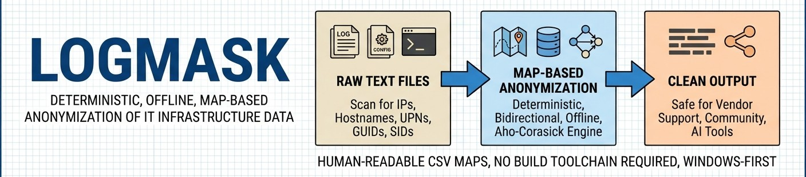
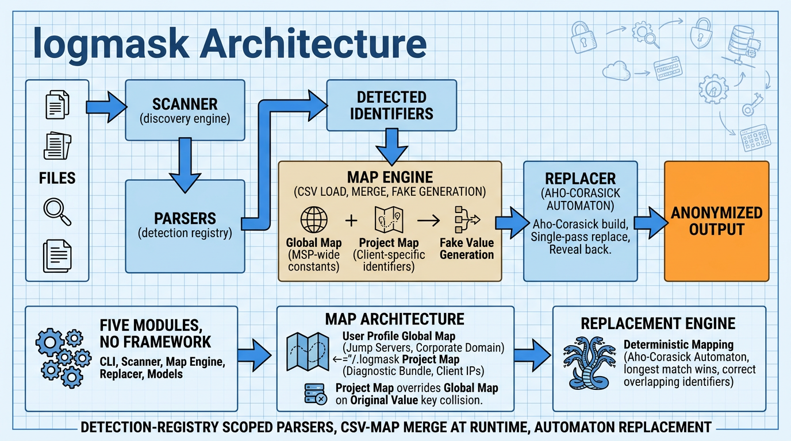

<!--
---
title: "logmask"
description: "Deterministic, offline, map-based anonymization of IT infrastructure data in text files"
author: "VintageDon"
date: "2026-03-01"
version: "0.1.0"
status: "Development"
tags:
  - type: project-root
  - domain: security
  - domain: msp-tooling
  - tech: python
  - tech: aho-corasick
  - tech: cli
related_documents:
  - "[Build Spec](docs/logmask-buidl-spec-v1.md)"
  - "[Agent Context](AGENTS.md)"
---
-->

# 🔒 logmask

[](https://python.org)
[](LICENSE)
[](LICENSE-DATA)
[]()



> Deterministic, offline, map-based anonymization of IT infrastructure data in text files.

logmask is a Python CLI tool designed for MSP operational security. When engineers need to paste logs, configs, or transcripts into external tools — Claude, vendor support portals, community forums — they need to strip infrastructure identifiers first. logmask scans files for those identifiers, builds a persistent translation map, and performs single-pass replacement using an Aho-Corasick automaton. The tool is bidirectional: anonymize out, reveal back.

---

## 🔭 Overview

### The Problem

MSP engineers routinely share diagnostic data with third parties. Every log file, every config export, every support ticket risks leaking internal infrastructure topology — IP ranges, hostnames, domain names, user principal names, Active Directory SIDs. Manual redaction is slow, inconsistent, and error-prone.

### The Approach

logmask treats anonymization as a deterministic mapping problem rather than a search-and-destroy exercise. A persistent CSV map links each real identifier to a fake replacement. The same input with the same map always produces byte-identical output. Maps are human-readable and auditable — engineers can open them in Excel, hand-edit entries, and share them across teams.

The replacement engine uses an Aho-Corasick automaton for single-pass, longest-match-wins substitution. This means overlapping identifiers (a hostname embedded in a FQDN, a subnet containing individual IPs) are handled correctly without multiple passes or ordering dependencies.

### Critical Constraints

| Constraint | Detail |
|------------|--------|
| **No build toolchain on endpoints** | All dependencies install via `pip install` from pre-built wheels. No C/Rust compilation. No admin elevation. |
| **Windows-first** | Primary target: Entra-joined Windows 10/11 endpoints. Works in standard user context. |
| **Offline execution** | Zero network calls at runtime. No cloud APIs, no telemetry, no update checks. |
| **Deterministic** | Same input + same map = byte-identical output. Every time. |
| **Human-readable maps** | CSV format. Engineers can open, audit, and hand-edit maps in Excel/Notepad. |

---

## 📊 Project Status

| Milestone | Status | Description |
|-----------|--------|-------------|
| Core build | ✅ Complete | All modules implemented, parsers working |
| Unit tests | ✅ Complete | Parsers, map engine, replacer, roundtrip |
| Post-review fixes | ✅ Complete | Bug documentation, code review applied |
| Known bug fixes | ⬜ Planned | Replacer state corruption, IPv4 octet validation, dead code cleanup |
| Scanner/CLI tests | ⬜ Planned | Unit test coverage for scanner.py and cli.py |
| Real-world validation | ⬜ Planned | Testing against production log corpus |
| PyPI release | ⬜ Future | Package and publish |

### Current Capabilities (v0.1.0)

The tool processes text files with comprehensive identifier detection across eight pattern types. The core replacement engine is correct and deterministic — known issues are documented in [AGENTS.md](AGENTS.md) and marked inline in source.

---

## 🎯 Identifier Types

| Type | Pattern Target | Example |
|------|----------------|---------|
| `ipv4` | RFC1918 private IPs | `10.0.1.50`, `192.168.100.10` |
| `cidr` | Subnet notation | `192.168.1.0/24`, `10.0.0.0/16` |
| `hostname` | NetBIOS and FQDNs | `SQL-PROD-03`, `server.contoso.local` |
| `upn` | User Principal Names | `jsmith@contoso.com` |
| `guid` | Entra object IDs, Azure GUIDs | `a1b2c3d4-e5f6-7890-abcd-ef1234567890` |
| `sid` | Windows Security Identifiers | `S-1-5-21-123-456-789-1001` |
| `mac` | MAC addresses | `AA:BB:CC:11:22:33`, `11-22-33-44-55-66` |
| `unc` | UNC paths | `\\\\FILESVR\\Finance$` |

---

## 🏗️ Architecture

Five modules, no framework. Parsers are internal callables in a dictionary registry.



### Components

| Component | Module | Purpose |
|-----------|--------|---------|
| CLI | `cli.py` | argparse — 6 commands (init, scan, anonymize, reveal, map show, map add) |
| Scanner | `scanner.py` | Discovery engine — runs parsers, deduplicates, filters collisions |
| Parsers | `parsers/` | Registry of detection functions, one per identifier type |
| Map Engine | `map_engine.py` | CSV map CRUD, scope merge (global + project), fake value generation |
| Replacer | `replacer.py` | Aho-Corasick automaton build + single-pass replace + reveal |
| Models | `models.py` | Frozen dataclasses — `DetectedIdentifier`, `MapEntry`, `Config` |

### Map Architecture

Translation maps are CSV files with two scope levels that merge at runtime:

| Scope | Location | Purpose |
|-------|----------|---------|
| Global | `%USERPROFILE%\.logmask\global_map.csv` | MSP-wide constants (jump servers, monitoring hosts, corporate domain) |
| Project | `./.logmask/project_map.csv` | Client-specific identifiers for this diagnostic bundle |

Project map overrides global map on `original_value` key collision. Merge happens at runtime load, never mutates either source file.

---

## 📁 Repository Structure

```
logmask/
├── 📂 assets/                      # Repository images
├── 📂 docs/                        # Documentation
│   └── logmask-buidl-spec-v1.md    # Authoritative build specification
├── 📂 src/logmask/                 # Source (PEP 621 src layout)
│   ├── cli.py                      # argparse CLI — 6 commands
│   ├── scanner.py                  # Discovery engine
│   ├── map_engine.py               # CSV map CRUD, scope merge, fake generation
│   ├── replacer.py                 # Aho-Corasick automaton + single-pass replace
│   ├── models.py                   # Frozen dataclasses (data contracts)
│   └── 📂 parsers/                 # Detection registry
│       ├── ipv4.py                 # RFC1918 private IPs
│       ├── cidr.py                 # Subnet/CIDR notation
│       ├── hostname.py             # NetBIOS + FQDN (structural heuristics)
│       ├── identity.py             # UPNs, Entra GUIDs, Windows SIDs
│       └── network.py              # MAC addresses, UNC paths
├── 📂 tests/                       # Unit tests
│   ├── conftest.py                 # Synthetic log fixtures
│   ├── test_parsers.py
│   ├── test_map_engine.py
│   ├── test_replacer.py
│   └── test_roundtrip.py           # Anonymize → reveal → hash compare
├── AGENTS.md                       # Agent context (KiloCode, Claude Code)
├── CLAUDE.md                       # Claude Code context
├── CODE_OF_CONDUCT.md
├── CONTRIBUTING.md
├── LICENSE                         # MIT (code)
├── LICENSE-DATA                    # CC BY 4.0 (documentation, data)
├── SECURITY.md
├── pyproject.toml                  # PEP 621 project config
└── README.md
```

---

## 🚀 Getting Started

### Prerequisites

- Python 3.10 or higher
- pip (no admin elevation required)
- Windows 10/11 (primary target) or any OS with Python 3.10+

### Installation

```bash
# Clone the repository
git clone https://github.com/radioastronomyio/logmask.git
cd logmask

# Install in development mode
pip install -e ".[dev]"
```

All dependencies have pre-built Windows wheels on PyPI — no compiler toolchain required:

| Package | Purpose |
|---------|---------|
| `pyahocorasick` >= 2.3.0 | Aho-Corasick automaton (C extension) |
| `pandas` | CSV map load/merge/write |
| `rich` | Terminal table output |

### Quick Start

```bash
# Initialize a project (creates .logmask/ with empty map)
logmask init --client "Acme Corp"

# Scan files for infrastructure identifiers
logmask scan ./logs --ext .log .txt .json

# Anonymize — replace real values with fakes
logmask anonymize ./logs --out ./anonymized_logs

# Reveal — reverse the anonymization
logmask reveal ./anonymized_logs --out ./revealed_logs

# Inspect the translation map
logmask map show --scope project
```

### Running Tests

```bash
# Run all tests
pytest

# Run with coverage
pytest --cov=src/logmask

# Run specific test file
pytest tests/test_parsers.py
```

---

## 📄 License

Code is licensed under the MIT License — see [LICENSE](LICENSE) for details.

Documentation and non-code content is licensed under CC BY 4.0 — see [LICENSE-DATA](LICENSE-DATA) for details.

---

## 🙏 Acknowledgments

- [pyahocorasick](https://github.com/WojciechMula/pyahocorasick) — Efficient multi-pattern matching
- Anthropic — Claude and the agent ecosystem that motivated this tool

---

Last Updated: 2026-03-01 | v0.1.0 Alpha | Core Build Complete
