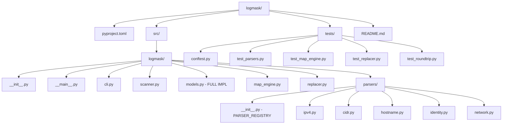

# Phase1: Scaffold logmask Repository Skeleton

## Overview

This plan outlines the scaffolding of the `logmask` Python CLI tool repository structure. This is Phase1 of a4-phase build process.

## Goals

- Create complete directory structure per specification
- Only `models.py` has full implementations
- All other modules have docstrings, type hints, and stub implementations
- PEP621 compliant `pyproject.toml`
- Test infrastructure with synthetic fixtures

## Directory Structure



## File Implementation Details

### 1. pyproject.toml

**PEP621 compliant configuration:**
- Package metadata: name=logmask, version=0.1.0
- Dependencies: pyahocorasick>=2.3.0, pandas, typer, rich
- Dev dependencies: pytest, pytest-cov
- src layout configuration
- Console script: logmask = logmask.cli:main

### 2. models.py - FULLY IMPLEMENTED

Three dataclasses with complete implementations:

| Class | Fields | Purpose |
|-------|--------|---------|
| DetectedIdentifier | value, identifier_type, start_pos, end_pos, confidence | Represents a found identifier in text |
| MapEntry | identifier_type, original_value, anonymized_value, scope, preserve_format | CSV map row structure |
| Config | global_map_path, project_map_path, extensions | Runtime configuration |

### 3. Parser Module Stubs

Each parser file follows the contract:
```python
def parse(text: str, config: Config) -> list[DetectedIdentifier]:
    raise NotImplementedError
```

**PARSER_REGISTRY in parsers/__init__.py:**
- ipv4: RFC1918 IPv4 addresses
- cidr: Subnet/CIDR notation
- hostname: NetBIOS + FQDN
- identity: UPNs, Entra GUIDs, SIDs
- network: MAC addresses, UNC paths

### 4. Test Infrastructure

- **conftest.py**: Synthetic log fixtures - NO real client data
- Test file stubs for: parsers, map_engine, replacer, roundtrip

## Execution Order

1. Create pyproject.toml
2. Create src/logmask/__init__.py
3. Create src/logmask/__main__.py
4. Create src/logmask/cli.py
5. Create src/logmask/scanner.py
6. Create src/logmask/models.py - FULL IMPLEMENTATION
7. Create src/logmask/map_engine.py
8. Create src/logmask/replacer.py
9. Create src/logmask/parsers/__init__.py
10. Create parser stubs: ipv4.py, cidr.py, hostname.py, identity.py, network.py
11. Create tests/conftest.py
12. Create test stubs: test_parsers.py, test_map_engine.py, test_replacer.py, test_roundtrip.py
13. Create README.md

## Verification Checklist

- [ ] All directories created
- [ ] All files have proper docstrings
- [ ] Type hints present on all function signatures
- [ ] models.py has complete dataclass implementations
- [ ] PARSER_REGISTRY dict properly structured
- [ ] pyproject.toml valid for pip install -e .
- [ ] README.md has installation and usage instructions

## Notes

- No actual parser logic implementation
- No engine logic implementation
- No CLI command implementation
- Only structural scaffolding and models.py
